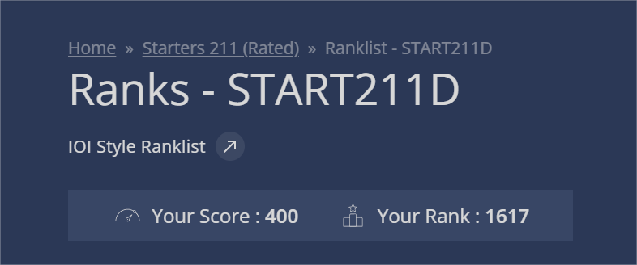

# CodeChef Starters 211 (Rated)

> My solutions for the CodeChef Starters 211 contest, held on November 5, 2025.

---

## 🏆 Contest Performance

I participated in the Starters 211 contest and solved 4 problems! Here's a screenshot of my rank:

  

---

## ✅ Solved Problems

Here are the 4 problems I solved during the contest, along with links to my C++ solutions.

| # | Problem Name | Solution File |
| :--- | :--- | :--- |
| 1 | **Fuel Check** | [`1_Fuel_Check.cpp`](./1_Fuel_Check.cpp) |
| 2 | **Buying Chairs** | [`2_Buying_Chairs.cpp`](./2_Buying_Chairs.cpp) |
| 3 | **Wolf Down** | [`3_Wolf_Down.cpp`](./3_Wolf_Down.cpp) |
| 4 | **No Doubling** | [`4_No_Doubling.cpp`](./4_No_Doubling.cpp) |
