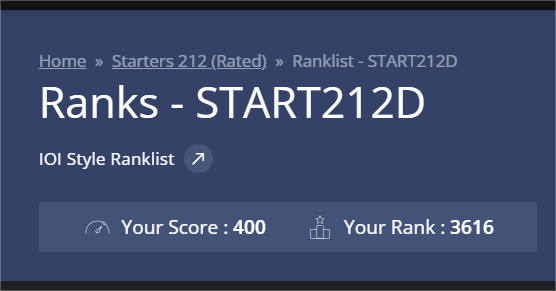

# CodeChef Starters 212 (Rated)

> My solutions for the CodeChef Starters 212 contest, held on November 12, 2025.

---

## 🏆 Contest Performance

I participated in the Starters 212 contest and solved 4 problems! Here's a screenshot of my rank:

  

---

# problme A. Basketball_Score
---
### 💡 Logic / Approach
**Problem:** Calculate the total basketball score based on the count of 3-pointers and 2-pointers scored.

**Solution:**
1. Read the number of 3-pointers (`X`) and 2-pointers (`Y`).
2. Apply the standard scoring formula: `Total = (X * 3) + (Y * 2)`.
3. Print the result.
4. Time complexity is **O(1)**.
---
# problme B. Signal
---
### 💡 Logic / Approach
**Problem:** Count how many pulse periods (`1`) occur *after* the first silence (`0`) has been observed.

**Solution:**
1. Initialize a flag `found_silence` to false.
2. Iterate through the binary string.
3. Once a `'0'` is encountered, set the flag to true.
4. For every `'1'` encountered **after** the flag is set, increment the answer counter.
5. This runs in **O(N)** time complexity.
---
# problme C. Exit_Door
---
### 💡 Logic / Approach
**Problem:** People leave the room in decreasing order of their ID ($N$ down to $1$). They choose the side (Left or Right) that disturbs the fewest people remaining in the row.

**Solution:**
1. Simulate the process starting from the person with the highest ID ($N$).
2. Find the current position of that person in the row.
3. Calculate the number of people to their left and to their right.
4. Add the minimum of the two values (`min(left, right)`) to the total disturbance count.
5. **Remove** that person from the row (simulating them leaving) and repeat for the next highest ID.
---
# problme D. Binary_Flip
---
### 💡 Logic / Approach
**Problem:** Find the minimum flips required to make the count of substring `11` greater than or equal to the count of substring `00`.

**Solution:**
1. First, count the existing occurrences of `00` ($C_0$) and `11` ($C_1$).
2. If $C_1 \ge C_0$, no operations are needed (Answer = 0).
3. If not, we calculate the "gap" between them.
4. Since flipping a specific bit can effectively close the gap by 2 (by removing a `00` and potentially creating a `11`), we use a formula to find the minimum moves: `(C0 - C1 + 1) / 2`.
